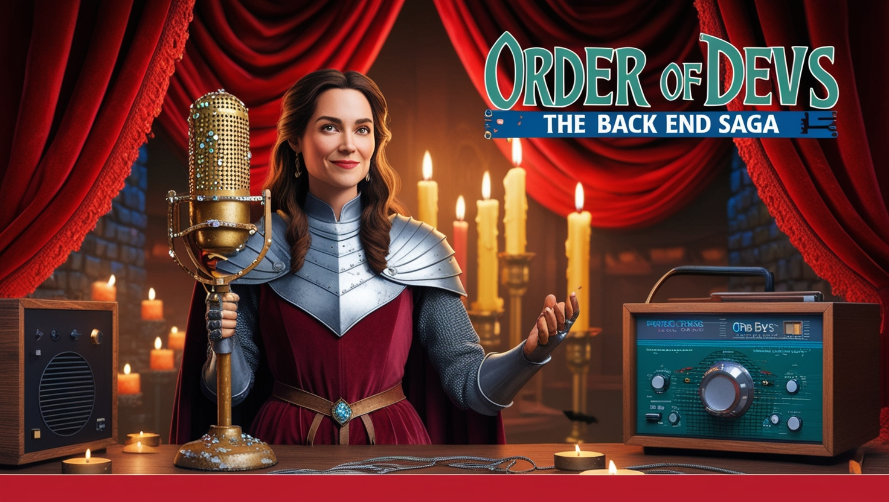

<h1 align="center">Ordem dos Devs: A Saga do Back End</h1>

Projeto com o objetivo de gerar um podcast utilizando ferramentas de IA através de prompts mais trabalhados.

Utilizei uma esteira de prompts para gerar cada etapa do processo criativo. 

## 💻 Projeto

Podcast - Ordem dos Devs: A Saga do Back End   

## 🚀 Tecnologias utilizadas no projeto 

Esse projeto foi desenvolvido com as seguintes tecnologias:

- [ChatGPT](https://chat.openai.com/)  
- [ElevenLabs](https://beta.elevenlabs.io/)  
- [Capcut](https://www.capcut.com/pt-br/)  
- [Leonardo.Ai](https://leonardo.ai/)  
- [DreamStudio](https://beta.dreamstudio.ai/generate)  

## ✨ Como foi feito ?

- Roteiro gerado via chatgpt
- Audio gerado pela ElevenLabs
- Leonardo.Ai e DreamStudio para gerar capas
- Capcut para tratar aúdio e adicionar sons de fundo

## 🔖 Layout

Você pode visualizar a descrição do desafio deste projeto através [DESSE LINK](https://github.com/felipeAguiarCode/prompts-for-podcast-generate-by-ia). 
  

## Expert

<a href="https://www.linkedin.com/in/kassia-moura-10775aa8/">LinkedIn</a>&nbsp;|&nbsp;
    <a href="https://www.instagram.com/kassia.amour/">Instagram</a>&nbsp;|&nbsp;

⌨️ com 💜 por [Kássia Almeida Moura](https://github.com/Kassia08)

  

## Bootcamp Santander 2024 - Fundamentos de IA para Devs
